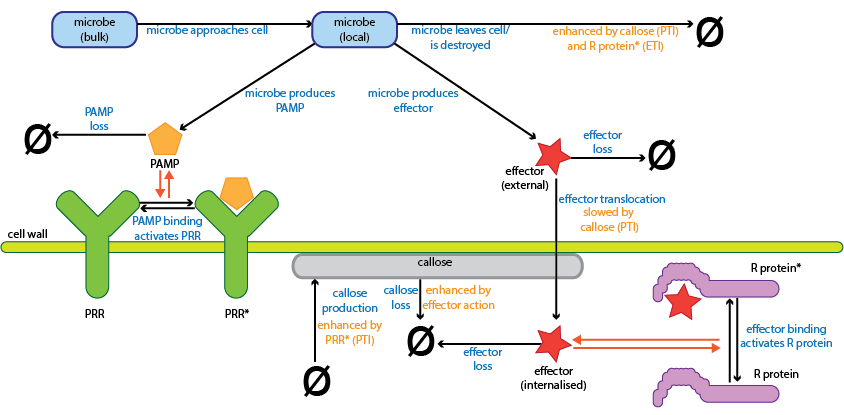
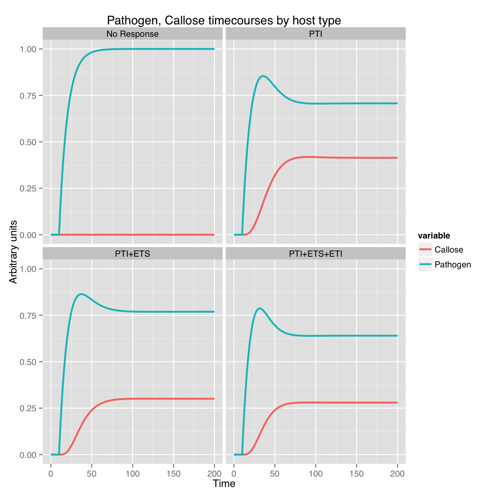
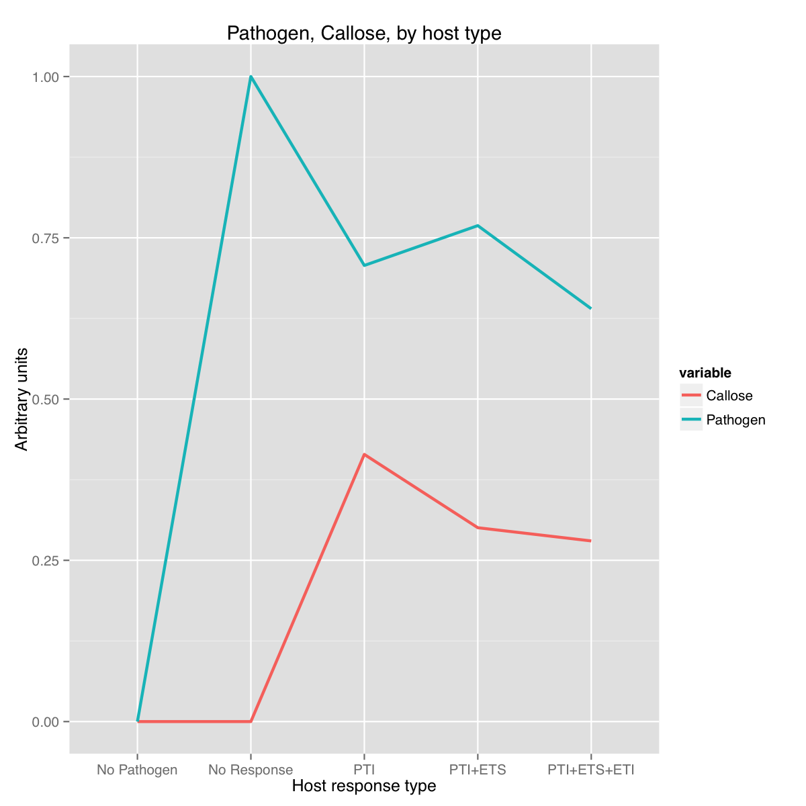

# README.md - Pritchard_Birch_2014

This directory contains supplementary information associated with the manuscript: Pritchard L & Birch PRJ "The zigzag model of plant-microbe interactions: is it time to move on?" (2014) *Molecular Plant Pathology* **15**(9):865-870. [doi:10.1111/mpp.12210](http://dx.doi.org/10.1111/mpp.12210)

## Overview

Despite the provocative title (the manuscript is an opinion piece), the aim of the manuscript is to try to make a case for the uptake of quantitative, dynamic molecular-scale models of plant-microbe interactions. These are useful as tools to understand better the molecular interplay between the interacting organisms, for interpretation of experimental results, and for hypothesis generation. 

The core of the opinion piece is a novel dynamic model of plant-microbe interactions, translating key elements of the prevailing zigzag model of the evolution of plant-microbe interactions [Jones & Dangl (2006)](http://dx.doi.org/10.1038/nature05286) into a dynamic model of interactions at a single-cell level, illustrated schematically, below.

The model was constructed using [COPASI](http://www.copasi.org/tiki-view_articles.php). Most steps/reactions in the model are mass-action kinetics, the exception being `Effector Translocation`, so that the inhibitory effect of callose deposition could be represented. 

The model's focus is on topology (which entities interact with each other, and whether reversibly or irreversibly), and we have little to no information on the kinetics of these interactions, so all parameters were left at default values.

Although the goal is to make the model quantitative and dynamic, since the model represents entities at a number of scales (e.g. the 'concentration' of a microbe or of callose does not mean much), all quantitites are left dimensionless. 

The model does not integrate any other downstream molecular processes, nor does it incorporate host cell death, so it is not possible to interpret the interaction in terms of how well the host is exploited or how much of it is destroyed. Instead the amount of local pathogen present is interpreted to indicate pathogen success, and the amount of callose present to indicate the strength of immune system response.

The aim here is to demonstrate that even in the absence of complete parameterisation or mechanistic understanding, a basic quantitative, dynamic model gives useful output, and generates responses that resemble features seen in an experimental system.

With these caveats, the model produces responses that are reasonable in terms of a restricted understanding of a 'real' system, but we have not taken care to parameterise it closely, to include all possible aspects of the molecular interactions, or model the interactions themselves in any great detail. Hence we can infer that interaction topology contributes a great deal to responses of the host immune system.

The model itself is available at the Biomodels database with accession MODEL1408280000, at [http://www.ebi.ac.uk/biomodels-main/](http://www.ebi.ac.uk/biomodels-main/).

It should be possible to improve upon and extend this basic model to represent circumstances such as multiple PAMPs/PRRs, effectors/R genes and their interactions, and to add signalling networks and other host molecular processes.

## Files

* `Figure_1a.pdf`: Figure 1a from the paper - a schematic diagram of the interactions in the model
* `Figure_1b.pdf`: Figure 1b from the paper - timecourses of the model run with various aspects of the interaction active (or not)
* `Figure_1c.pdf`: Figure 1c from the paper - steady-state outputs of the model run with various aspects of the interaction active (or not)
* `LICENSE`: the license for use/reuse of these materials
* `generate_graphs.Rmd`: R markdown file describing the generation of figures 1b and 1c
* `generate_graphs.pdf`: The PDF output of `generate_graphs.Rmd`
* `model_equations.png`: image file describing the ODEs of the model, produced by COPASI
* `model_equations.tex`: LaTeX source file describing the ODEs of the model, produced by COPASI
* `no_path.txt`: model output: no pathogen present
* `no_pti_no_supp_no_eti.txt`: model output: pathogen present, but no PTI, ETI, or effector production
* `pti_no_supp_no_eti.txt`: model output: PTI only
* `pti_supp_eti.txt`: model output: PTI, effector suppression and ETI
* `pti_supp_no_eti.txt`: model output: PTI, effector suppression of PTI, but no ETI
* `toy_plant_immune_system.cps`: The model system in COPASI format
* `toy_plant_immune_system.xml`: The model system in SBML (level 2v4) format

## LICENCE

Except where otherwise noted, the example programs and other software provided here are made available under the [OSI](http://opensource.org/)-approved [MIT License](http://opensource.org/licenses/mit-license.html).

Copyright (c) 2014 The James Hutton Institute

Permission is hereby granted, free of charge, to any person obtaining a copy of this software and associated documentation files (the "Software"), to deal in the Software without restriction, including without limitation the rights to use, copy, modify, merge, publish, distribute, sublicense, and/or sell copies of the Software, and to permit persons to whom the Software is furnished to do so, subject to the following conditions:

The above copyright notice and this permission notice shall be included in all copies or substantial portions of the Software.

THE SOFTWARE IS PROVIDED "AS IS", WITHOUT WARRANTY OF ANY KIND, EXPRESS OR IMPLIED, INCLUDING BUT NOT LIMITED TO THE WARRANTIES OF MERCHANTABILITY, FITNESS FOR A PARTICULAR PURPOSE AND NONINFRINGEMENT. IN NO EVENT SHALL THE AUTHORS OR COPYRIGHT HOLDERS BE LIABLE FOR ANY CLAIM, DAMAGES OR OTHER LIABILITY, WHETHER IN AN ACTION OF CONTRACT, TORT OR OTHERWISE, ARISING FROM, OUT OF OR IN CONNECTION WITH THE SOFTWARE OR THE USE OR OTHER DEALINGS IN THE SOFTWARE.